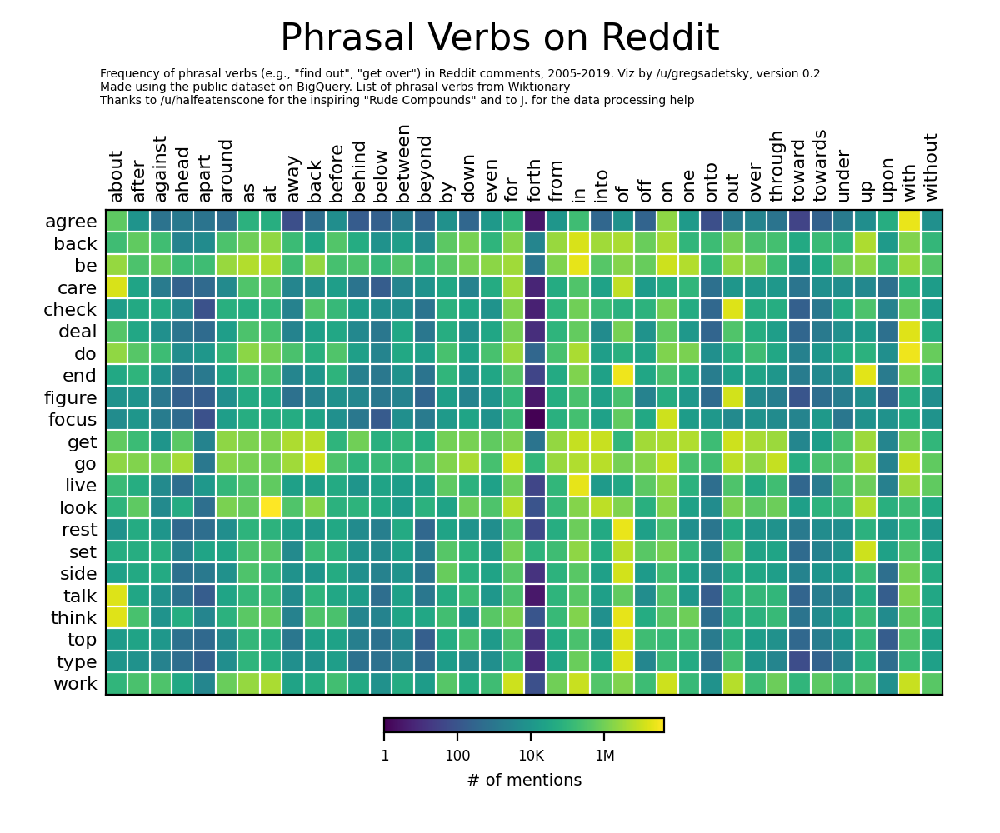

# phrasal-verbs

## data

- frequency data for all phrasal verbs in [data.csv](data.csv)

## how to recreate

- run [bigquery.sql](bigquery.sql) on BigQuery. it will process ~1Tb in ~1.5 minutes (which is completely mindblowing)
- save the result to `data.csv`, then run [viz.py](viz.py) -- assumes python3, pandas, matplotlib

## data sources

- phrasal verbs collected from [Wiktionary](https://en.wiktionary.org/w/index.php?title=Category:English_phrasal_verbs)
- reddit comments 2005-2019 from the [public BigQuery dataset](https://cloud.google.com/bigquery/public-data)
  - look for `fh-bigquery.reddit_comments`
